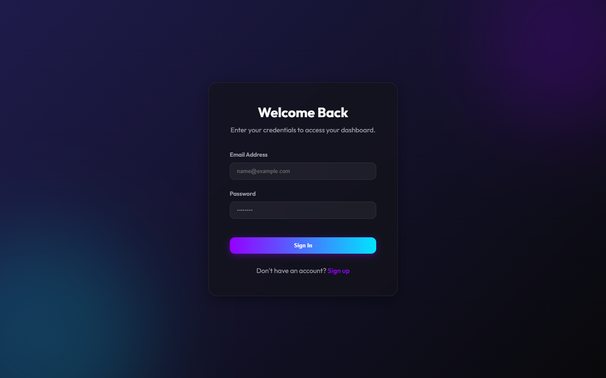
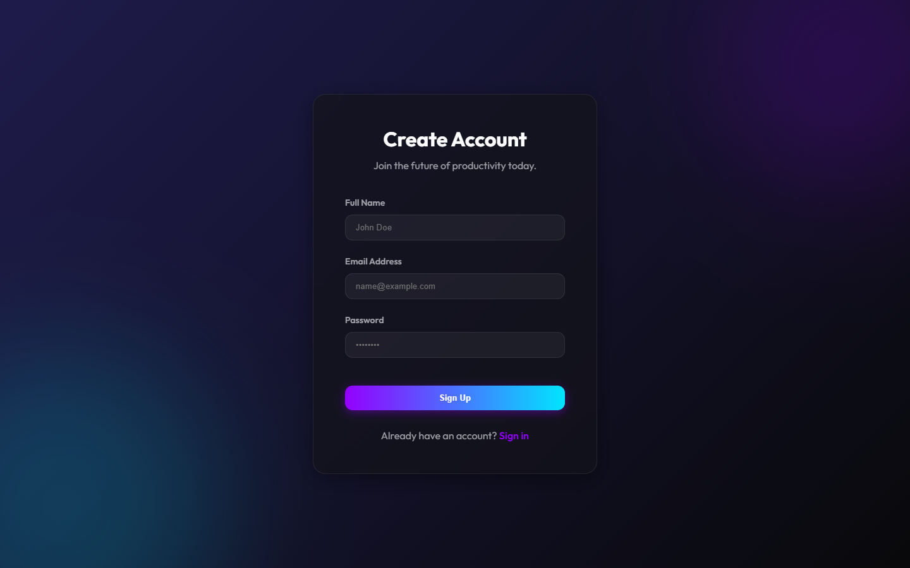
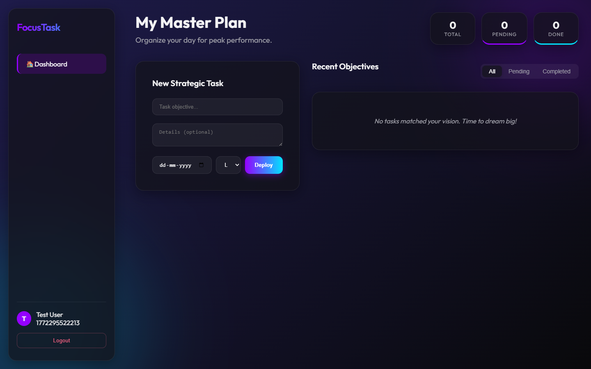
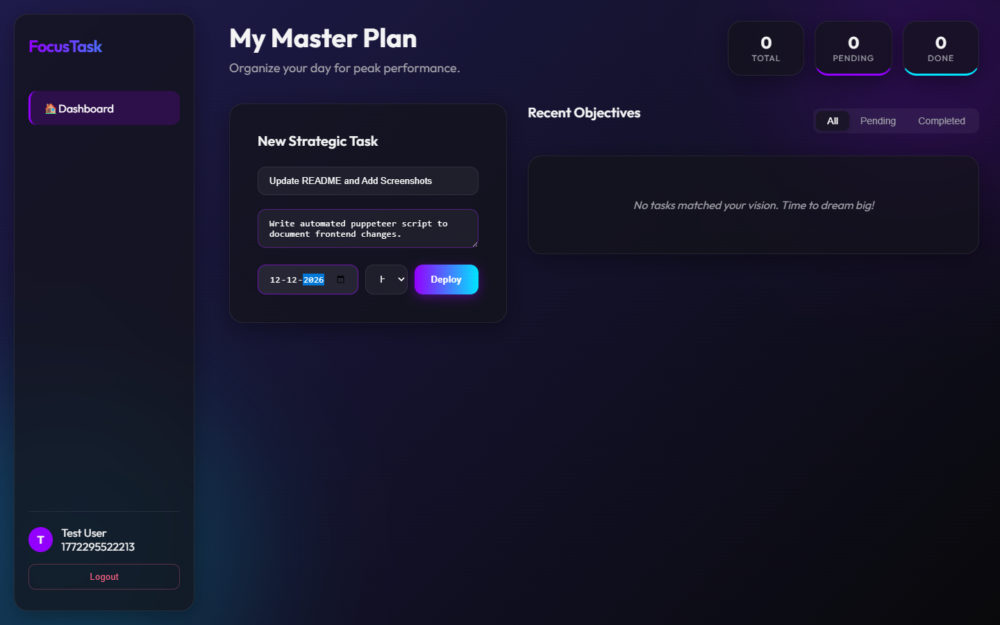
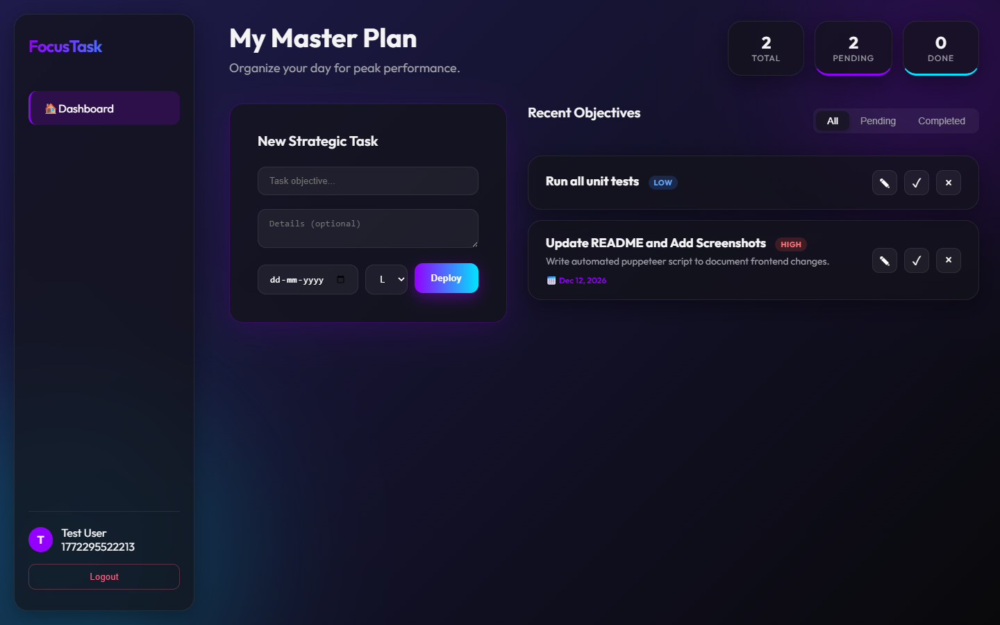
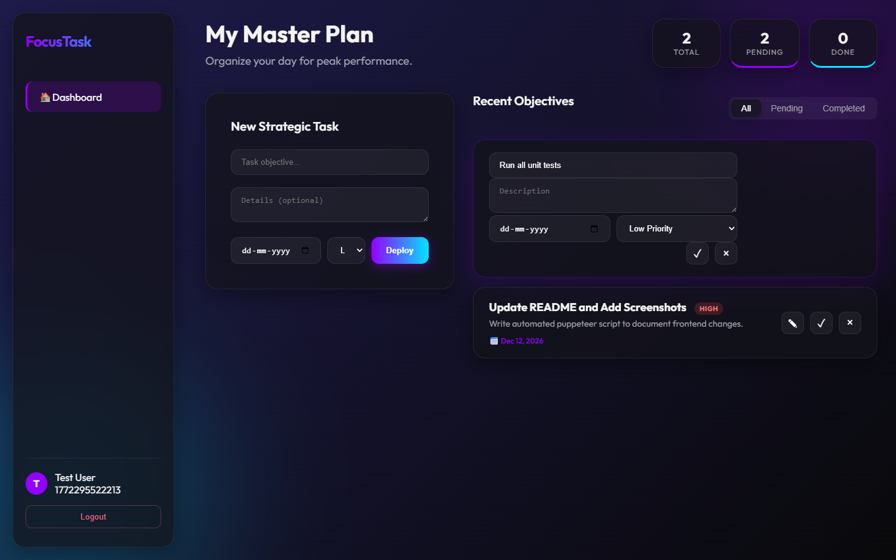

<div align="center">

# 🎯 FocusTask — Task Management App

**A full-stack, premium-grade task management application with JWT-secured REST APIs, an **Angular 19** frontend, and a **Node.js / Express** backend powered by **PostgreSQL** via TypeORM.**

<br/>

[](https://angular.dev)
[](https://nodejs.org)
[](https://expressjs.com)
[](https://www.postgresql.org)
[](https://typeorm.io)
[](https://jwt.io)
[](https://opensource.org/licenses/ISC)

<br/>



</div>

---

## 📋 Table of Contents

- [Overview](#-overview)
- [Features](#-features)
- [Tech Stack](#-tech-stack)
- [Project Structure](#-project-structure)
- [Prerequisites](#-prerequisites)
- [Installation](#-installation)
- [Configuration](#-configuration)
- [Running the Application](#-running-the-application)
- [App Screenshots](#-app-screenshots)
- [API Reference](#-api-reference)
- [Database Schema](#-database-schema)
- [Authentication Flow](#-authentication-flow)
- [Roadmap](#-roadmap)
- [Troubleshooting](#-troubleshooting)

---

## 🎯 Overview

**FocusTask** is a premium SaaS-inspired productivity app enabling users to organize their work with maximum clarity. It features a fully-secured REST API backend and a stunning glassmorphic Angular 19 frontend built with **Signals** and **Standalone Components** for best-in-class performance.

Key highlights:
- 🔐 **Role-Based Access Control (RBAC)** — Admin and User roles
- ⚡ **Real-time reactive UI** — Angular Signals for zero-overhead state management
- 🎨 **Glassmorphism UI** — Premium dark-theme with gradient accents
- 🏗️ **Clean Architecture** — Controllers → Services → DTOs → Entities
- ✅ **Full CRUD** — Create, read, update, delete tasks with instant UI feedback

---

## ✨ Features

### For Users
| Feature | Description |
|---|---|
| 🔑 **Authentication** | Secure JWT register/login with bcrypt password hashing |
| 📝 **Task CRUD** | Create, view, edit, delete tasks in real-time |
| 🎯 **Priority Levels** | Tag tasks as `Low`, `Medium`, or `High` priority |
| ✅ **Status Tracking** | Toggle tasks between `Pending` and `Completed` |
| 📅 **Due Dates** | Set and display task deadlines |
| 🔍 **Smart Filters** | Filter task list by All / Pending / Completed |
| 📊 **Live Stats** | Dashboard header shows real-time task counters |
| ✏️ **Inline Editing** | Edit tasks directly in the list without page changes |

### Technical Highlights
| Feature | Description |
|---|---|
| 🛡️ **RBAC Middleware** | Role-based route protection (`admin` / `user`) |
| 📦 **DTO Validation** | All inputs validated with dedicated DTO functions |
| 🗄️ **TypeORM ORM** | Type-safe DB operations with auto schema sync |
| 🌐 **CORS** | Configured for secure frontend-backend communication |
| 🔒 **Bcrypt** | Password hashed with 10 salt rounds |

---

## 🛠 Tech Stack

### Frontend
| Technology | Version | Purpose |
|---|---|---|
| **Angular** | 19 | UI Framework (Standalone + Signals) |
| **TypeScript** | 5.x | Type-safe development |
| **RxJS** | 7.x | Reactive HTTP streams |
| **Angular Router** | 19 | Client-side routing + Auth Guard |
| **FormsModule** | 19 | Two-way data binding |
| **Vanilla CSS** | — | Custom glassmorphism design system |

### Backend
| Technology | Version | Purpose |
|---|---|---|
| **Node.js** | 22+ | Runtime environment |
| **Express** | 5.x | Web framework |
| **TypeORM** | 0.3.x | ORM & schema management |
| **PostgreSQL** | 15+ | Primary relational database |
| **jsonwebtoken** | 9.x | JWT token generation & verification |
| **bcryptjs** | 2.x | Password hashing |
| **dotenv** | 17.x | Environment variable management |
| **cors** | 2.x | Cross-origin request handling |

---

## 📁 Project Structure

```
Task-Management-App/
├── backend/
│   ├── src/
│   │   ├── app.js                    # Express app setup + CORS
│   │   ├── server.js                 # Server entry point
│   │   ├── config/
│   │   │   └── data-source.js        # TypeORM DataSource config
│   │   ├── controllers/
│   │   │   ├── authController.js     # Login / Register logic
│   │   │   ├── taskController.js     # Task CRUD endpoint handlers
│   │   │   └── userController.js     # User management (admin)
│   │   ├── dtos/
│   │   │   ├── authDto.js            # Auth input validation
│   │   │   └── taskDto.js            # Task create/update validation
│   │   ├── entity/
│   │   │   ├── User.js               # User table schema (with role)
│   │   │   └── Task.js               # Task table schema (with priority)
│   │   ├── middleware/
│   │   │   ├── auth.js               # JWT verification middleware
│   │   │   └── roleAuth.js           # RBAC role-check middleware
│   │   ├── routes/
│   │   │   ├── authRoutes.js         # POST /auth/register, /auth/login
│   │   │   ├── taskRoutes.js         # Full CRUD for /tasks
│   │   │   └── userRoutes.js         # Admin-only /users routes
│   │   └── services/
│   │       ├── authService.js        # Auth business logic
│   │       ├── taskService.js        # Task business logic
│   │       └── userService.js        # User business logic
│   ├── .env                          # Environment configuration
│   └── package.json
│
├── frontend/
│   ├── src/
│   │   ├── main.ts                   # Angular bootstrap
│   │   ├── styles.css                # Global design tokens & utilities
│   │   └── app/
│   │       ├── app.component.ts      # Root component (shell layout)
│   │       ├── app.config.ts         # Providers (Router, HttpClient)
│   │       ├── app.routes.ts         # Route definitions + authGuard
│   │       ├── guards/
│   │       │   └── auth.guard.ts     # Protects /dashboard route
│   │       ├── services/
│   │       │   ├── auth.service.ts   # Login, Register, token storage
│   │       │   └── task.service.ts   # Task API HTTP calls
│   │       └── pages/
│   │           ├── login/            # Login page component
│   │           ├── register/         # Register page component
│   │           └── dashboard/        # Main task management UI
│   └── package.json
│
├── docs/                             # Auto-generated screenshots
└── README.md
```

---

## 📋 Prerequisites

Before you begin, ensure you have installed:

-  — [Download](https://nodejs.org/)
-  — [Download](https://www.postgresql.org/download/)
-  — `npm install -g @angular/cli`

---

## 🚀 Installation

### 1. Clone the Repository

```bash
git clone https://github.com/your-username/Task-Management-App.git
cd Task-Management-App
```

### 2. Install Backend Dependencies

```bash
cd backend
npm install
```

### 3. Install Frontend Dependencies

```bash
cd ../frontend
npm install
```

---

## ⚙️ Configuration

### Backend — `backend/.env`

```env
# Server
PORT=5000

# Database (PostgreSQL)
DB_TYPE=postgres
DB_HOST=localhost
DB_PORT=5432
DB_USERNAME=postgres
DB_PASSWORD=your_db_password
DB_NAME=taskmanagement

# JWT
JWT_SECRET=your_super_secret_jwt_key_change_in_production
```

### Frontend — `frontend/.env`

```env
NG_APP_API_BASE=http://localhost:5000/api
```

### Create the PostgreSQL Database

```sql
CREATE DATABASE taskmanagement;
```

> TypeORM will automatically create all tables on first run via `synchronize: true`.

---

## 🏃 Running the Application

### 1. Start the Backend

```bash
cd backend
npm start
```

Expected output:
```
🚀 Server running on port 5000
✅ Database connected successfully.
📊 Database: taskmanagement
```

### 2. Start the Frontend

```bash
cd frontend
npm start
```

Open your browser and navigate to **[http://localhost:4200](http://localhost:4200)**

---

## 🖼️ App Screenshots

### 1. Login Page
Secure JWT authentication with a premium glassmorphic card design.


---

### 2. Register Page
New user registration with full name, email, and password validation.



---

### 3. Dashboard — Empty State
After logging in, users are greeted with a beautifully designed empty state encouraging them to create their first task.



---

### 4. Creating a Task
Fill in the task title, optional description, due date, and priority level to deploy your first task.



---

### 5. Task List with Priority Badges
Tasks are displayed with live-updating stats. Colour-coded priority badges (`LOW` / `MEDIUM` / `HIGH`) make urgency instantly visible.



---

### 6. Inline Task Editing
Click the ✎ edit icon on any task to switch into edit mode without leaving the page. Update the title, description, due date, or priority and save instantly.



---

## 📚 API Reference

**Base URL:** `http://localhost:5000/api`

All protected routes require the header:
```
Authorization: Bearer <your_jwt_token>
```

### 🔐 Auth Endpoints

| Method | Endpoint | Description | Auth |
|---|---|---|---|
| `POST` | `/auth/register` | Register a new user | ❌ |
| `POST` | `/auth/login` | Login and receive JWT | ❌ |

**Register body:**
```json
{
  "name": "John Doe",
  "email": "john@example.com",
  "password": "securepassword123"
}
```

**Login response:**
```json
{
  "token": "eyJhbGciOiJIUzI1NiIsInR5cCI6IkpXVCJ9...",
  "user": { "id": 1, "name": "John Doe", "email": "john@example.com" }
}
```

---

### 📝 Task Endpoints

| Method | Endpoint | Description | Auth |
|---|---|---|---|
| `GET` | `/tasks` | Get all tasks for logged-in user | ✅ |
| `GET` | `/tasks/:id` | Get a single task by ID | ✅ |
| `POST` | `/tasks` | Create a new task | ✅ |
| `PUT` | `/tasks/:id` | Update a task (partial support) | ✅ |
| `DELETE` | `/tasks/:id` | Delete a task | ✅ |

**Create / Update task body:**
```json
{
  "title": "Design onboarding flow",
  "description": "Sketch wireframes for 3 screens",
  "dueDate": "2026-06-30",
  "status": "pending",
  "priority": "high"
}
```

> `status` accepts: `pending` | `in-progress` | `completed`  
> `priority` accepts: `low` | `medium` | `high`

---

### 👤 User Endpoints *(Admin only)*

| Method | Endpoint | Description | Auth |
|---|---|---|---|
| `GET` | `/users` | Get all users | ✅ Admin |
| `GET` | `/users/:id` | Get user by ID | ✅ Admin |
| `PUT` | `/users/:id` | Update user | ✅ Admin |
| `DELETE` | `/users/:id` | Delete user | ✅ Admin |

---

## 🗄️ Database Schema

### `users` Table

| Column | Type | Constraints |
|---|---|---|
| `id` | `INT` | Primary Key, Auto-increment |
| `name` | `VARCHAR` | Not Null |
| `email` | `VARCHAR` | Unique, Not Null |
| `password` | `VARCHAR` | Not Null (bcrypt hashed) |
| `role` | `VARCHAR` | Default: `user` |
| `createdAt` | `TIMESTAMP` | Auto |
| `updatedAt` | `TIMESTAMP` | Auto |

### `tasks` Table

| Column | Type | Constraints |
|---|---|---|
| `id` | `INT` | Primary Key, Auto-increment |
| `title` | `VARCHAR` | Not Null |
| `description` | `TEXT` | Nullable |
| `status` | `VARCHAR` | Default: `pending` |
| `priority` | `VARCHAR` | Default: `low` |
| `dueDate` | `TIMESTAMP` | Nullable |
| `userId` | `INT` | Foreign Key → `users.id` |
| `createdAt` | `TIMESTAMP` | Auto |
| `updatedAt` | `TIMESTAMP` | Auto |

> **Index:** `IDX_TASK_USER` on `userId` for fast per-user queries.

---

## 🔐 Authentication Flow

```
User Submits Credentials
         │
         ▼
  Backend validates input (DTO)
         │
         ▼
  Bcrypt compares password hash
         │
         ▼
  JWT token generated (7-day expiry)
         │
         ▼
  Token stored in localStorage
         │
         ▼
  Angular AuthGuard reads token
  on every protected route
         │
    ┌────┴────┐
    │ Valid?  │
    └────┬────┘
   Yes   │   No
    ▼         ▼
Dashboard   Redirect → /login
```

---

## 🗺️ Roadmap

- [x] JWT Authentication (login / register)
- [x] Full Task CRUD
- [x] Task Priority Levels (Low / Medium / High)
- [x] Task Status Toggle (Pending ↔ Completed)
- [x] Inline Task Editing
- [x] Real-time Stats Dashboard
- [x] Filter by Status
- [x] RBAC (Admin / User roles)
- [ ] Drag-and-drop Kanban board
- [ ] Task search bar
- [ ] Email notifications for due tasks
- [ ] Dark / Light theme toggle
- [ ] File attachments on tasks
- [ ] Collaborative task sharing
- [ ] CSV / PDF export
- [ ] Password reset via email
- [ ] User avatar upload

---

## 🐛 Troubleshooting

### ❌ Database Connection Failed

1. Ensure PostgreSQL is running:
   ```bash
   # Windows
   net start postgresql-x64-16

   # macOS / Linux
   sudo service postgresql start
   ```
2. Double-check credentials in `backend/.env`
3. Make sure the database exists: `CREATE DATABASE taskmanagement;`

---

### ❌ JWT / Auth Errors

1. Clear browser storage: open DevTools → Application → `localStorage` → Clear All
2. Log in again to receive a fresh token
3. Ensure `JWT_SECRET` in `.env` matches what was used to generate the token

---

### ❌ Port Already In Use

```bash
# Windows
netstat -ano | findstr :5000
taskkill /PID <PID> /F

# macOS / Linux
lsof -ti:5000 | xargs kill
```

---

### ❌ CORS Errors

Ensure the backend `CORS` allowlist in `backend/src/app.js` includes your frontend URL (default: `http://localhost:4200`).

---

## 📄 License

This project is licensed under the **[ISC License](https://opensource.org/licenses/ISC)**.

---

## 👥 Contributing

Contributions are welcome! Please:

1. Fork the repository
2. Create a feature branch: `git checkout -b feature/your-feature`
3. Commit your changes: `git commit -m 'feat: add your feature'`
4. Push to the branch: `git push origin feature/your-feature`
5. Open a Pull Request

---

<div align="center">

**Built with ❤️ using Angular 19 + Node.js + PostgreSQL**

⭐ *If this project helped you, please give it a star!* ⭐

</div>
